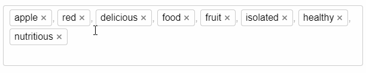

# ImsKeywordBox


**ImsKeywordBox** is Vue.js tag/keyword input component

> This editor originally created for my pet project [ImStocker](http://imstocker.com/) - keywording tool for microstockers.

[Docs & Demo](https://nordth.github.io/ims-keyword-box/)



## Features

- No dependencies
- Fully customizable by CSS
- Drag & drop
- Copy/cut/paste support (`ctrl/⌘+C`, `ctrl/cmd⌘+X`, `ctrl/⌘+V` and **context menu**)
- Undo/redo history (`ctrl/⌘+Z`, `ctrl/⌘+Y`)
- Keywords multiselect
- In-place keyword editing
- Removing duplicates
- Assigning different CSS-classes for different keywords
- Providing function to preprocess entered/pasted keywords
- Customizing separator. Hash-tag mode
- Mobile friendly
- Works with Vuex
- 50kb minified (css included) | gzipped 13kb
- Fast setup

## Coming soon

- Option to use an objects instead of the strings for `value` property (with title and key/id)
- Autocompletion

## Install

NPM
```
npm install ims-keyword-box
```

Browser via CDN
```
<script src=https://rawcdn.githack.com/Nordth/ims-keyword-box/v1.0.1/dist/ims-keyword-box.min.js"></script>
```

## Usage

```html
<template>
   <ims-keyword-box
       v-model="tags"
   />
</template>
```

```javascript
import ImsKeywordBox from 'ims-keyword-box';

export default {
  components: {
    ImsKeywordBox,
  },
  data() {
    return {
      keywords: []
    };
  },
};
```

## License

[MIT](LICENSE)

Copyright (c) 2020 Elantcev Mikhail
